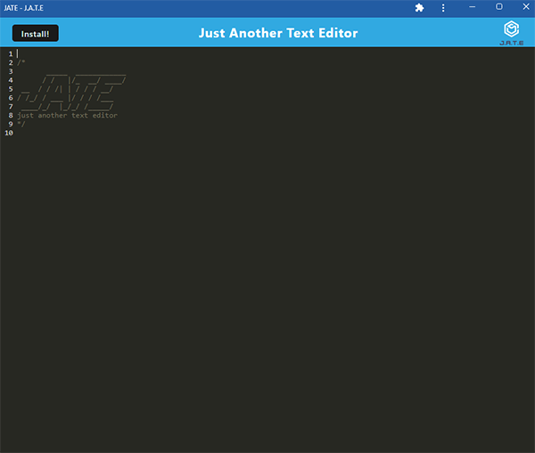

  
  # Editxt
  
  ## Table of Contents
  * [Description](#description)
  * [Technologies](#technologies)
  * [Installation](#installation)
  * [Usage](#usage)
  * [Contributing](#contributing)
  * [Guidelines](#guidelines)
  * [Tests](#tests)
  * [License](#license)
  * [Questions](#questions)
---

  ## Description
  Editxt is a simple text editor that uses indexedDB to store and retrieve information. Compiled using node, it incorporates the use of webpacks to render the UI and service worker to allow communication between the DOM and server so the application is able to run offline and be installed to run on a local machine, similar to a native app - making it a progressive web application or 'PWA'.

  

  ## Technologies
  * React
  * JavaScript
  * node.js
  

  ## Installation
   Visit [the application](http://editxt.herokuapp.com) and click on the install button

  ## Usage
   To use the application install node packages with npm installand start with npm run start - or visit editxt.herokuapp.com

  ## Contributing
   If you'd like to contribute, reach out via the email below

  ## Guidelines
   Can be used on or offline.

  ## Tests
   Tests run in development.

  ## License
   Licensed under [MIT](https://opensource.org/licenses/MIT) 

   ---

  ## Questions
   For any questions you can find me at [GitHub](https://github.com/mleftwich) or email me at [mleftwich@live.com](mailto:mleftwich@live.com) 
